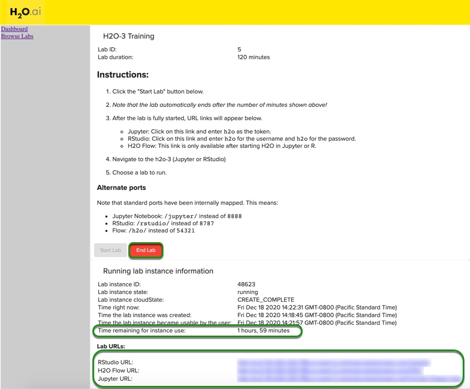
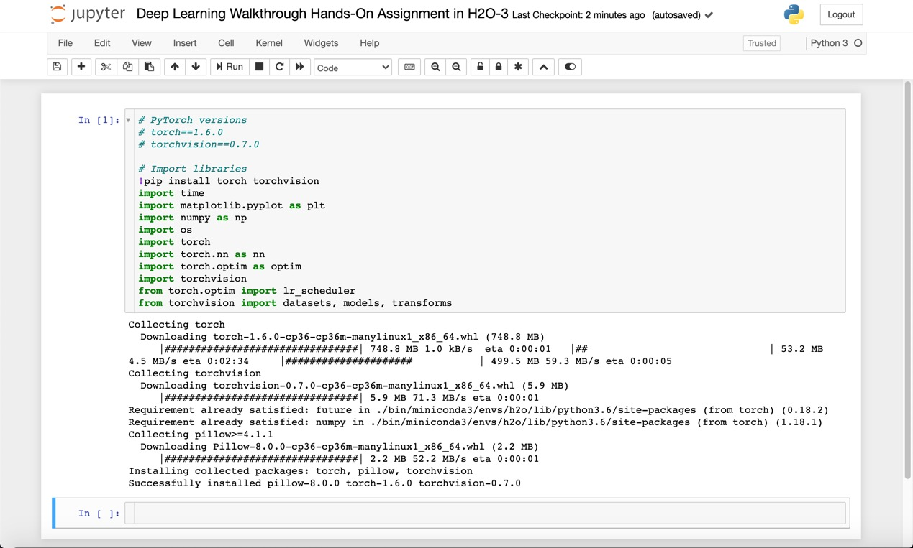
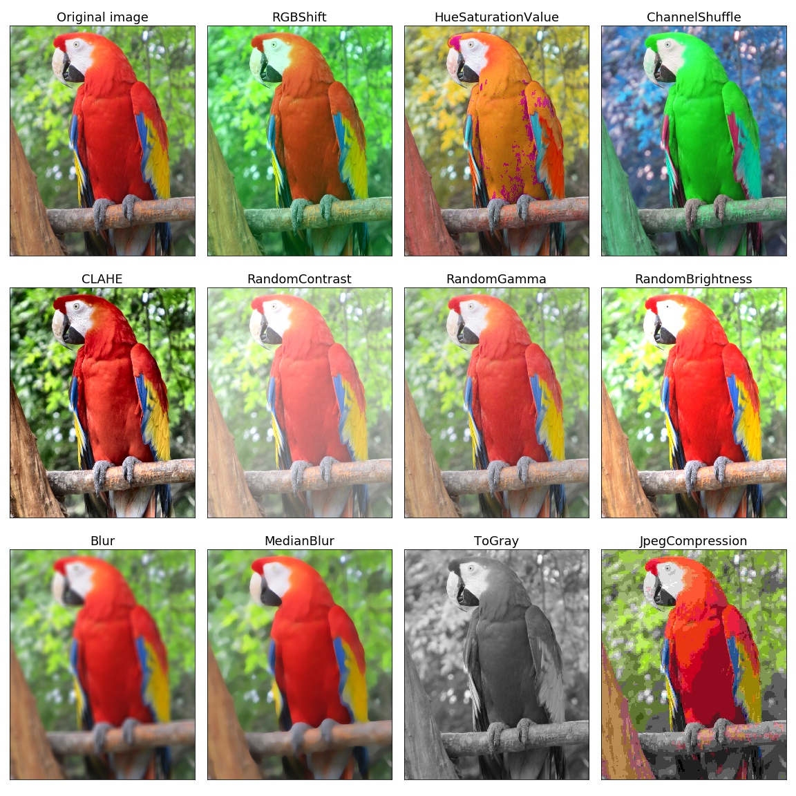

# Deep Learning Walkthrough Hands-On Assignment in H2O-3

## Objective
This is the hands-on exercise wherein you will be doing a walkthrough to observe how to apply Transfer Learning in Computer Vision Problems using PyTorch.

For this assignment, you will be using image data of natural scenes around the world. This data was initially published on [Analytics Vidhya](https://datahack.analyticsvidhya.com) platform by Intel to host an Image Classification Challenge and could be downloaded from [here](https://www.kaggle.com/puneet6060/intel-image-classification).
 
Note: This tutorial has been built on Aquarium, which is H2O.ai's cloud environment providing software access for workshops, conferences, and training. The labs in Aquarium have datasets, experiments, projects, and other content preloaded. If you use your version of H2O-3 or Driverless AI, you will not see preloaded content.
 
## Prerequisites
- Basic knowledge of Deep Learning
- An [Aquarium](https://aquarium.h2o.ai/) Account to access H2O.ai’s software on the AWS Cloud. 
    - Need an Aquarium account? Follow the instructions in the next section **Task 1 Create An Account & Log Into Aquarium** to create an account
    - Already have an Aquarium account? Log in and continue to Task 2 Launch **Lab 5: H2O-3 Training** to begin your exercise!
 
**Note:** Aquarium's Driverless AI lab has a license key built-in, so you don't need to request one to use it. Each Driverless AI lab instance will be available to you for two hours, after which it will terminate. No work will be saved. If you need more time to further explore Driverless AI, you can always launch another lab instance or reach out to our sales team via the [contact us form](https://www.h2o.ai/company/contact/).
 
## Task 1: Create An Account & Log Into Aquarium
 
Navigate to the following site: https://aquarium.h2o.ai/login and do the following:

1\. create a new account (if you don’t have one) 

2\. log into the site with your credentials.

3\. Navigate to Lab 5: H2O-3 Training. Click on Start Lab and wait for your instance to be ready. Once your instance is ready, you will see the following screen.



Click on the Jupyter URL to start a Jupyter Notebook or the H2O Flow instance( if required). You can create a new Jupyter Notebook and follow the steps defined below.
 
 
## Task 2: Open a New Jupyter Notebook
Open a new Jupyter Python3 Notebook by clicking New and selecting Python 3


In this notebook, you will: 
- Startup an H2O Cluster
- Import necessary packages
- Import the Credit Card dataset
- Train an isolation forest
- Inspect the Predictions

### Deeper Dive and Resources:
- [Jupyter Notebook Tutorial](https://www.dataquest.io/blog/jupyter-notebook-tutorial/)
 
## Task 3: Setup PyTorch
In this section, you will use PyTorch and import all frameworks required. 

Note: You can give BASH commands in Jupyter by using a `!` character. We can use this to install PyTorch in Aquarium as follows:

1\. Install PyTorch

2\. Import necessary Modules

You can enter the following in the first cell:

```python
# PyTorch versions
# torch==1.6.0
# torchvision==0.7.0
 
# Import libraries
!pip install torch torchvision
import time
import matplotlib.pyplot as plt
import numpy as np
import os
import torch
import torch.nn as nn
import torch.optim as optim
import torchvision
from torch.optim import lr_scheduler
from torchvision import datasets, models, transforms
```
 
Your notebook should look like this:


 
### Deeper Dive and Resources:
- [Starting H2O from Python](http://docs.h2o.ai/h2o/latest-stable/h2o-docs/starting-h2o.html#from-python)

## Task 4: Import the Dataset

For this assignment, you will be using image data of natural scenes around the world. This data was initially published on [Analytics Vidhya](https://datahack.analyticsvidhya.com) platform by Intel to host an Image Classification Challenge and can be downloaded from [here](https://www.kaggle.com/puneet6060/intel-image-classification).

1\. Import the dataset using the URL
```python
# Download the data
!wget 'https://h2o-public-test-data.s3.amazonaws.com/bigdata/server/Image Data/intel_img_classification.zip'
!unzip intel_img_classification.zip
```
 
Note: The line with the # is a code comment.  These can be useful to describe what you are doing in a given section of code.
 
## Task 5: Load the data

We will work with a subset of the original dataset. It has 3k images: 2750 images in training set, and 250 images in the validation set. 

Images have the size of 150x150 pixels distributed under 6 categories:
- Buildings
- Forest
- Glacier
- Mountain
- Sea
- Street

```python
# Data augmentation and normalization for training
# Just normalization for validation
data_transforms = {
    "train": transforms.Compose(
        [
            transforms.Resize((160, 160)),
            transforms.RandomHorizontalFlip(p=0.5),
            transforms.RandomGrayscale(p=0.5),
            transforms.ToTensor(),
            transforms.RandomErasing(p=0.5),
            transforms.Normalize([0.485, 0.456, 0.406], [0.229, 0.224, 0.225]),
        ]
    ),
    "val": transforms.Compose(
        [
            transforms.Resize((160, 160)),
            transforms.ToTensor(),
            transforms.Normalize([0.485, 0.456, 0.406], [0.229, 0.224, 0.225]),
        ]
    ),
}
 
# Create Datasets
data_dir = "classification_data/"
image_datasets = {
    x: datasets.ImageFolder(os.path.join(data_dir, x), data_transforms[x])
    for x in ["train", "val"]
}
 
# Create Dataloaders
dataloaders = {
    x: torch.utils.data.DataLoader(
        image_datasets[x], batch_size=8, shuffle=True, num_workers=4
    )
    for x in ["train", "val"]
}
dataset_sizes = {x: len(image_datasets[x]) for x in ["train", "val"]}
class_names = image_datasets["train"].classes
 
def imshow(inp, title=None):
    """Imshow for Tensor."""
    inp = inp.numpy().transpose((1, 2, 0))
    mean = np.array([0.485, 0.456, 0.406])
    std = np.array([0.229, 0.224, 0.225])
    inp = std * inp + mean
    inp = np.clip(inp, 0, 1)
    plt.imshow(inp)
    if title is not None:
        plt.title(title)
 
        
def plot_grid(inputs, classes):
    """Make a grid from batch."""
    out = torchvision.utils.make_grid(inputs, nrow=4, padding=10, pad_value=255)
    plt.figure(figsize=(10, 10))
    imshow(out, title=[class_names[x] for x in classes])
 
    
# Get a batch of training data
inputs, classes = next(iter(dataloaders["train"]))
plot_grid(inputs, classes)
 
# Get a batch of validation data
inputs, classes = next(iter(dataloaders["val"]))
plot_grid(inputs, classes)
```
After you run the code above, you will see some of the images from the dataset that we will be using.

Before going to the next Task, here is an example of Augmentation (please note that this images are not part of our dataset)



 
## Task 6: Initialize the Model: ResNet 34
Initialization of ResNet


```Python
# Select the architecture and use ImageNet-pretrained weights
# The weights will be downloaded for the first time
model = models.resnet34(pretrained=True)
 
# Change the head of the model with the classes provided
num_ftrs = model.fc.in_features
model.fc = nn.Linear(num_ftrs, len(class_names))
 
# Initialize device
device = torch.device("cuda:0" if torch.cuda.is_available() else "cpu")
# Put the model to the device (GPU)
model = model.to(device)
 
# Initialize Loss function
criterion = nn.CrossEntropyLoss()
 
# Initialize the optimizer
optimizer = optim.SGD(model.parameters(), lr=0.001, momentum=0.9)
 
# Decay LR by a factor of 0.1 every 5 epochs
exp_lr_scheduler = lr_scheduler.StepLR(optimizer, step_size=5, gamma=0.1)
```
 
## Task 7: Train the Model

Next, we will train our model:

```Python
# Define number of epochs
num_epochs = 10
best_acc = 0.0
 
since = time.time()
 
# Loop over all epochs
for epoch in range(num_epochs):
    print(f"Epoch {epoch + 1}/{num_epochs}\n")
    print("-" * 10)
 
    # Each epoch has a train and validation phase
    for phase in ["train", "val"]:
        if phase == "train":
            model.train()  # Set model to training mode
        else:
            model.eval()  # Set model (all layers) to evaluate mode
 
        running_loss = 0.0
        running_corrects = 0
 
        # Iterate over data
        for inputs, labels in dataloaders[phase]:
            
            # Put data to the devic (GPU)
            inputs = inputs.to(device)
            labels = labels.to(device)
 
            # Zero the parameter gradients (not to accumulate them)
            optimizer.zero_grad()
 
            # Forward pass
            # Track history if only in the train phase
            with torch.set_grad_enabled(phase == "train"):
                outputs = model(inputs)
                _, preds = torch.max(outputs, 1)
                loss = criterion(outputs, labels)
 
                # Backward pass + optimize only if in train phase
                if phase == "train":
                    loss.backward()
                    optimizer.step()
 
            # Calculate running train and validation statistics
            running_loss += loss.item() * inputs.size(0)
            running_corrects += torch.sum(preds == labels.data)
            
        # Schedule learning rate in the train phase
        if phase == "train":
            exp_lr_scheduler.step()
 
        # Calculate epoch train and validation statistics
        epoch_loss = running_loss / dataset_sizes[phase]
        epoch_acc = running_corrects.double() / dataset_sizes[phase]
        print("{} Loss: {:.4f} Acc: {:.4f}\n".format(phase, epoch_loss, epoch_acc))
 
        # Save the weights of the best model so far
        if phase == "val" and epoch_acc > best_acc:
            best_acc = epoch_acc
            torch.save(model.state_dict(), "best_model.ckpt")
 
time_elapsed = time.time() - since
print("Training complete in {:.0f}m {:.0f}s".format(time_elapsed // 60, time_elapsed % 60))
```

## Task 8: Visually Validate the results
Lastly, once the model is finished training, we can visualize results:

```Python
# Show the best validation accuracy
print("Best val Acc: {:4f}".format(best_acc))
 
# Load the best model weights and set to the eval mode
model.load_state_dict(torch.load("best_model.ckpt"))
model.eval()
 
def visualize_model(model, num_images=6):
    images_so_far = 0
    fig = plt.figure(figsize=(12, 12))
 
    # Do not track history of the forward pass
    with torch.no_grad():
        
        # Iterate through validation data
        for i, (inputs, labels) in enumerate(dataloaders["val"]):
            # Put data on the GPU
            inputs = inputs.to(device)
            labels = labels.to(device)
 
            # Make predictions
            outputs = model(inputs)
            _, preds = torch.max(outputs, 1)
 
            # Plot images
            for j in range(inputs.size()[0]):
                images_so_far += 1
                ax = plt.subplot(num_images // 2, 2, images_so_far)
                ax.axis("off")
                ax.set_title("predicted: {}".format(class_names[preds[j]]))
                imshow(inputs.cpu().data[j])
 
                if images_so_far == num_images:
                    return
 
visualize_model(model)
```
 
## Next Steps

In the above study, you learned above how to apply Transfer Learning in CV using PyTorch.

- Read More about PyTorch [here](https://pytorch.org)

- Checkout the PyTorch docs [here](https://pytorch.org/docs)
